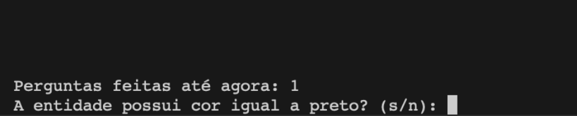
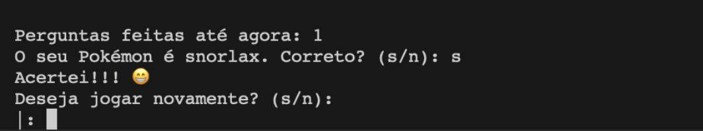
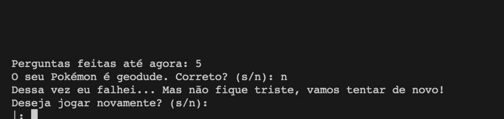
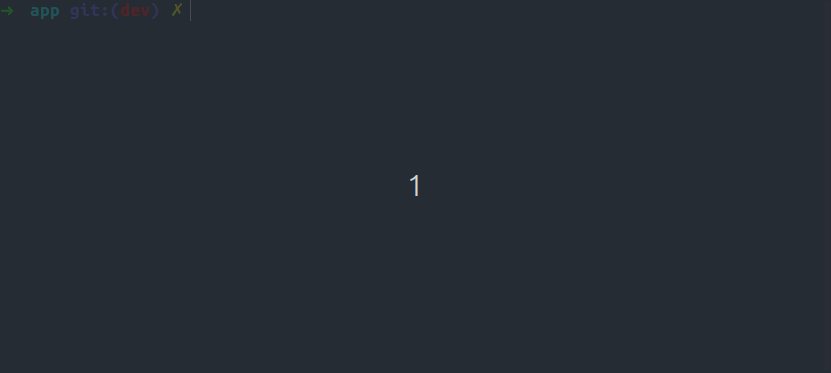

# Pokenator
 

**Disciplina**: FGA0210 - PARADIGMAS DE PROGRAMAÇÃO - T01 <br>
**Nro do Grupo**: 03 <br>
**Paradigma**: Logico <br>

## Alunos
| Matrícula | Aluno                             |
| --------- | --------------------------------- |
| 190124997 | Amanda Nobre                      |
| 200017772 | Fellipe Pereira da Costa Silva    |
| 190028122 | Gabriel Sabanai Trindade          |
| 200037994 | Guilherme Barbosa Ferreira        |
| 190029731 | Ingrid da Silva Carvalho          |
| 190046848 | Laís Portela de Aguiar            |
| 221007653 | Luciano Ricardo da Silva Junior   |
| 190033681 | Luiz Henrique Fernandes Zamprogno |
| 200025449 | Natan Tavares Santana             |
| 200042416 | Pablo Christianno Silva Guedes    |


## Sobre 

Esse projeto corresponde a segunda entrega do Grupo3.

Seu principal objetivo é implementar o jogo Akinator, com o tema de Pokemon, utilizando a linguagem Prolog e a API pokeAPI para o seu desenvolvimento.

### O que é Akinator?


O Akinator é um jogo virtual desenvolvido em 2007 que tem como objetivo adivinhar o personagem em que o usuário esteja pensando atráves de diversas perguntas. Após respondidas, ele traz o resultado baseado nas respostas do jogador. No caso do jogo original, ele é representado por um gênio virtual.

### O que é Pokemon


Pokemon é uma franquia de mídia criada em 1995 pela Gamefreak e publicada pela Nintendo. Seu primeiro lançamento corresponde a duas versões do mesmo jogo com o título "Pocket Monsters Red" e "Pocket Monsters Green". A franquia principal e originaria consiste em um jogo de RPG na qual o jogador pode capturar e evoluir monstros de diversos tipos. Devido ao seu enorme sucesso, novos tipos de mídia foram surgindo ao longo dos anos com a criação de jogos spin-off, diversas temporadas de animes e diversos filmes lançados, tendo extrema relevancia em todos. Com isso, Pokemon tem um forte impacto dentro da cultura pop e atualmente corresponde a franquia de mídia mais valiosa do mundo, estimada em US$ 92,121 bilhões.

### Sobre o projeto

Tendo esses dois temas como base, buscamos por desenvolver um jogo na qual o usuário responde diversas perguntas, sobre características de Pokemon, em formato de "sim ou não" e, no final, o programa deve responder o Pokemon correto na qual o jogador esteja pensando.

Dentro do jogo, um Pokemon é referenciado como "entidade" e cada uma das características é definida como "predicado". As caracteristicas são divididas em ***tipos***, ***altura***, ***peso***, ***cor***, ***habitat*** e ***formato***. Para entender mais, acessar [information_base.md](./app/information_base.md).

## Screenshots
### Tela inical

### Tela de pergunta

### Tela de acerto

### Tela de erro


## Instalação 
**Linguagens**: Prolog<br>
**Tecnologias**: Não tem<br> 

Para poder utilizar a aplicação é necessário ter instalado na sua maquina o [***SWI Prolog***](https://www.swi-prolog.org/)

Recomenda-se que faça a instalação via terminal, segue um passo a passo de como instalar:

<details><summary>Instalação para o Mac</summary>

Para instalar no mac, deve-se ter instalado o [***Homebrew***](https://brew.sh/). Sua instalação está bem documentada dentro do seu site (clique em "Homebrew").

Com o [***Homebrew***](https://brew.sh/) instalado, rode o seguinte comando:

```bash
brew install swi-prolog
```
</details>


<details><summary>Instalação para o Linux</summary>

#### Para distribuições baseadas no Debian/Ubuntu (como Ubuntu, Linux Mint, etc.):

Abra o terminal e execute os seguintes comandos:

```bash
sudo apt update
sudo apt install swi-prolog
```
#### Para distribuições baseadas no Fedora (Fedora, RHEL, CentOS, etc.):

Abra o terminal e execute:
```bash
sudo dnf install swi-prolog
```

#### caso esteja utilizando uma versão mais antiga do Fedora que usa yum, utilize:

```bash
sudo yum install swi-prolog
```
</details>


### Após ter o prolog instalado

1. Entre na pasta app
```bash
cd app
```

2. Execute o arquivo main.pl
```bash
swipl main.pl
```


## Uso 

Para utilizar o jogo, basta rodar o arquivo main.pl, que irá iniciar o jogo.

No menu principal serão apresentadas as opções de jogar e sair. Para jogar, basta digitar 1 e pressionar enter, para sair, digite 2 e pressionar enter.

Para responder a pergunta, basta digitar `s` ou `n` e pressionar enter.

A qualquer momento é possivel escrever `exit` e pressionar enter para sair do jogo.

Quando o jogo acabar é possivel escolher se quer jogar novamente ou sair.




## Vídeo
<!-- Adicione 1 ou mais vídeos com a execução do projeto.
Procure: 
(i) Introduzir o projeto;
(ii) Mostrar passo a passo o código, explicando-o, e deixando claro o que é de terceiros, e o que é contribuição real da equipe;
(iii) Apresentar particularidades do Paradigma, da Linguagem, e das Tecnologias, e
(iV) Apresentar lições aprendidas, contribuições, pendências, e ideias para trabalhos futuros.
OBS: TODOS DEVEM PARTICIPAR, CONFERINDO PONTOS DE VISTA.
TEMPO: +/- 15min -->

## Participações

Aqui está a tabela com os nomes em ordem alfabética:

| Nome do Membro    | Contribuição                                | Significância da Contribuição para o Projeto (Excelente/Boa/Regular/Ruim/Nula) | Comprobatórios                                                                                                          |
| ----------------- | ------------------------------------------- | ------------------------------------------------------------------------------ | ----------------------------------------------------------------------------------------------------------------------- |
| Amanda Nobre      | Adiciona predicado de adivinhacao final     | Excelente                                                                      | [Adiciona predicado de adivinhacao final](https://github.com/UnBParadigmas2024-2/2024.2_G3_Logico_Pokenator/pull/11)    |
| Fellipe Pereira   | Adiciona predicado de adivinhacao final     | Excelente                                                                      | [Adiciona predicado de adivinhacao final](https://github.com/UnBParadigmas2024-2/2024.2_G3_Logico_Pokenator/pull/11)    |
| Gabriel Sabanai   | Melhorias no banco de conhecimento          | Boa                                                                            | [Melhorias no banco de conhecimento](https://github.com/UnBParadigmas2024-2/2024.2_G3_Logico_Pokenator/pull/12)         |
| Guilherme Barbosa | Melhorias no banco de conhecimento          | Boa                                                                            | [Melhorias no banco de conhecimento](https://github.com/UnBParadigmas2024-2/2024.2_G3_Logico_Pokenator/pull/12)         |
| Ingrid Carvalho   | Criação de banco de conhecimento            | Excelente                                                                      | [Criação de banco de conhecimento](https://github.com/UnBParadigmas2024-2/2024.2_G3_Logico_Pokenator/pull/7)            |
| Lais Portela      | Criação de banco de conhecimento            | Excelente                                                                      | [Criação de banco de conhecimento](https://github.com/UnBParadigmas2024-2/2024.2_G3_Logico_Pokenator/pull/7)            |
| Luciano Ricardo   | Interface de jogo                           | Excelente                                                                      | [Interface de jogo](https://github.com/UnBParadigmas2024-2/2024.2_G3_Logico_Pokenator/pull/9)                           |
| Luiz Henrique     | Implementação incial do motor de inferencia | Excelente                                                                      | [Implementação incial do motor de inferencia](https://github.com/UnBParadigmas2024-2/2024.2_G3_Logico_Pokenator/pull/8) |
| Natan Tavares     | Interface de jogo                           | Excelente                                                                      | [Interface de jogo](https://github.com/UnBParadigmas2024-2/2024.2_G3_Logico_Pokenator/pull/9)                           |
| Pablo Christianno | Implementação incial do motor de inferencia | Excelente                                                                      | [Implementação incial do motor de inferencia](https://github.com/UnBParadigmas2024-2/2024.2_G3_Logico_Pokenator/pull/8) |

## Outros 
Abaixo consta os relatos de cada membro da equipe, no que se diz respeito a lições aprendidas, contribuições, percepções, fragilidades e trabalhos futuros.

<details><summary>Amanda Nobre</summary>

### Lições Aprendidas  
- 

### Percepções  
- 

### Contribuições e Fragilidades  
- 

### Trabalhos Futuros  
- 

</details>

<details><summary>Fellipe Pereira</summary>

### Lições Aprendidas  
- 

### Percepções  
- 

### Contribuições e Fragilidades  
- 

### Trabalhos Futuros  
- 

</details>

<details><summary>Gabriel Sabanai</summary>

### Lições Aprendidas  
- 

### Percepções  
- 

### Contribuições e Fragilidades  
- 

### Trabalhos Futuros  
- 

</details>

<details><summary>Guilherme Barbosa</summary>

### Lições Aprendidas  
- 

### Percepções  
- 

### Contribuições e Fragilidades  
- 

### Trabalhos Futuros  
- 

</details>

<details><summary>Ingrid Carvalho</summary>

### Lições Aprendidas  
- 

### Percepções  
- 

### Contribuições e Fragilidades  
- 

### Trabalhos Futuros  
- 

</details>

<details><summary>Lais Portela</summary>

### Lições Aprendidas  
- 

### Percepções  
- 

### Contribuições e Fragilidades  
- 

### Trabalhos Futuros  
- 

</details>

<details><summary>Luciano Ricardo</summary>

### Lições Aprendidas  
- O desenvolvimento do projeto ajudou a melhorar minha lógica de programação e habilidades de resolução de problemas.  

### Percepções  
- O Prolog foi mais dificil comparado ao Haskell.

### Contribuições e Fragilidades  
- Alem de liderar o grupo fazendo o planejamento do projeto e divisão do trabalho entre membros, eu desenvolvi principalmente na parte de menu do jogo. 
- Tive bastante dificuldade em entender o Prolog, enquanto linguagem, mas acho que entendi o paradigma relativamente bem. 

### Trabalhos Futuros  
- Expandir a base de conhecimento para abranger todas as gerações de Pokemon.  
- Implementar a opção "Não sei" como resposta válida.  
- Criar uma interface gráfica para facilitar o uso.  
- Melhorar a representação de informações como peso e altura, utilizando uma tradução mais amigável.  

</details>

<details><summary>Luiz Henrique</summary>

### Lições Aprendidas  
- a

### Percepções  
- 

### Contribuições e Fragilidades  
- 

### Trabalhos Futuros  
- 

</details>

<details><summary>Natan Tavares</summary>

### Lições Aprendidas  
- 

### Percepções  
- 

### Contribuições e Fragilidades  
- 

### Trabalhos Futuros  
- 

</details>

<details><summary>Pablo Christianno</summary>

### Lições Aprendidas  
- 

### Percepções  
- 

### Contribuições e Fragilidades  
- 

### Trabalhos Futuros  
- 

</details>

## Fontes
[**Site oficial da PokeAPI:**](https://pokeapi.co/)

[**Site oficial do Akinator:**](https://pt.akinator.com/)

[**Site oficial do Pokémon:**](https://www.pokemon.com/br)

[**Site oficial do Prolog:**](https://www.swi-prolog.org/)

[**Site oficial do Homebrew:**](https://brew.sh/)

[**Projeto Akinator GOT**](https://github.com/Paradigmas-2-2017/akinator-of-thrones)

## Curiosidades
Essa sessão é apenas curiosidades divertidas, logo será utilizada uma linguagem bem informal. Divirta-se e depois, se quiser, fale na revisão qual é o seu pokemon favorito ❤️.


O melhor pokemon é definitivamente o Squirtle, pega o drip do pai - Sabanai


O melhor é o Gengar porque eu claramente não tenho personalidade para escolher um pokemon melhor :D - Gui (Escrito por Sabanai)


Meu Pokemon favorito é o Charizard (achei mt normie - Sabanai) porque eu gosto muito de dragões huhu - Natan


Meu pokémon favorito é o Snorlax - Felipe, Luís


O Charmander claramente é o melhor 🔥 - Ricardo

/i.s3.glbimg.com/v1/AUTH_bc8228b6673f488aa253bbcb03c80ec5/internal_photos/bs/2021/k/W/ey3W2jRAmAY9m4dAgfZg/charmander.jpg)


Obviamente o melhor é o Charizard - Lais


O melhor Pokemon é o Sylveon, muito diva - Amanda


O pokemon show é o Jigglypuff, ele canta!! :D - Ingrid


O mais daora é o Lucario, pega o design dele que style - Pablo

