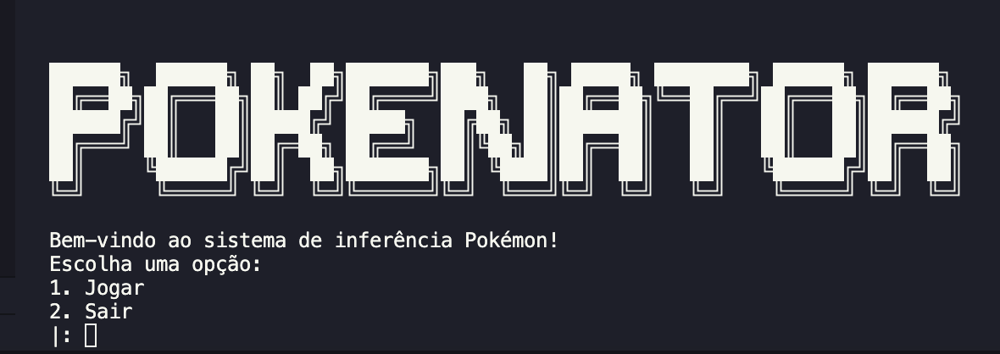

# Pokenator
 

**Disciplina**: FGA0210 - PARADIGMAS DE PROGRAMAÇÃO - T01 <br>
**Nro do Grupo**: 03 <br>
**Paradigma**: Logico <br>

## Alunos
| Matrícula | Aluno                             |
| --------- | --------------------------------- |
| 190124997 | Amanda Nobre                      |
| 200017772 | Fellipe Pereira da Costa Silva    |
| 190028122 | Gabriel Sabanai Trindade          |
| 200037994 | Guilherme Barbosa Ferreira        |
| 190029731 | Ingrid da Silva Carvalho          |
| 190046848 | Laís Portela de Aguiar            |
| 221007653 | Luciano Ricardo da Silva Junior   |
| 190033681 | Luiz Henrique Fernandes Zamprogno |
| 200025449 | Natan Tavares Santana             |
| 200042416 | Pablo Christianno Silva Guedes    |


## Sobre 
<!-- Descreva o seu projeto em linhas gerais. 
Use referências, links, que permitam conhecer um pouco mais sobre o projeto.
Capriche nessa seção, pois ela é a primeira a ser lida pelos interessados no projeto. -->

## Screenshots
<!-- Adicione 2 ou mais screenshots do projeto em termos de interface e/ou funcionamento. -->

## Instalação 
**Linguagens**: Prolog<br>
**Tecnologias**: xxxxxx<br> <!--TODO -->
<!-- Descreva os pré-requisitos para rodar o seu projeto e os comandos necessários.
Insira um manual ou um script para auxiliar ainda mais.
Gifs animados e outras ilustrações são bem-vindos! -->

## Uso 
<!-- Explique como usar seu projeto.
Procure ilustrar em passos, com apoio de telas do software, seja com base na interface gráfica, seja com base no terminal.
Nessa seção, deve-se revelar de forma clara sobre o funcionamento do software. -->


1. Tenha o Prolog instalado

2. Entre na pasta app
```bash
cd app
```

3. Execute o arquivo main.pl
```bash
swipl main.pl
```

## Vídeo
<!-- Adicione 1 ou mais vídeos com a execução do projeto.
Procure: 
(i) Introduzir o projeto;
(ii) Mostrar passo a passo o código, explicando-o, e deixando claro o que é de terceiros, e o que é contribuição real da equipe;
(iii) Apresentar particularidades do Paradigma, da Linguagem, e das Tecnologias, e
(iV) Apresentar lições aprendidas, contribuições, pendências, e ideias para trabalhos futuros.
OBS: TODOS DEVEM PARTICIPAR, CONFERINDO PONTOS DE VISTA.
TEMPO: +/- 15min -->

## Participações

Aqui está a tabela com os nomes em ordem alfabética:

| Nome do Membro    | Contribuição | Significância da Contribuição para o Projeto (Excelente/Boa/Regular/Ruim/Nula) | Comprobatórios           |
| ----------------- | ------------ | ------------------------------------------------------------------------------ | ------------------------ |
| Amanda Nobre      |              |                                                                                | [Adiciona predicado de adivinhacao final](https://github.com/UnBParadigmas2024-2/2024.2_G3_Logico_Pokenator/pull/11) |
| Fellipe Pereira    |              |                                                                                | [Adiciona predicado de adivinhacao final](https://github.com/UnBParadigmas2024-2/2024.2_G3_Logico_Pokenator/pull/11) |
| Gabriel Sabanai   |              |                                                                                | [Nome do PR](link_do_PR) |
| Guilherme Barbosa |              |                                                                                | [Nome do PR](link_do_PR) |
| Ingrid Carvalho   |              |                                                                                | [Nome do PR](link_do_PR) |
| Lais Portela      |              |                                                                                | [Nome do PR](link_do_PR) |
| Luciano Ricardo   |              |                                                                                | [Nome do PR](link_do_PR) |
| Luiz Henrique     |              |                                                                                | [Nome do PR](link_do_PR) |
| Natan Tavares     |              |                                                                                | [Nome do PR](link_do_PR) |
| Pablo Christianno |              |                                                                                | [Nome do PR](link_do_PR) |

## Outros 
<!-- Quaisquer outras informações sobre o projeto podem ser descritas aqui. Não esqueça, entretanto, de informar sobre:
(i) Lições Aprendidas;
(ii) Percepções;
(iii) Contribuições e Fragilidades, e
(iV) Trabalhos Futuros. -->

## Fontes
<!-- Referencie, adequadamente, as referências utilizadas.
Indique ainda sobre fontes de leitura complementares. -->
